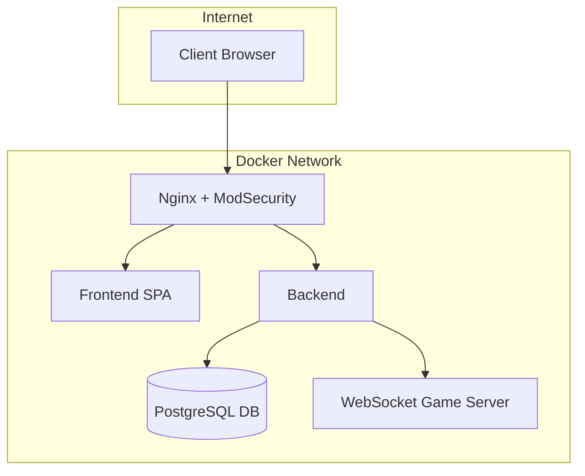

# 🏓 ft_transcendence

## 🎯 Project Overview

**ft_transcendence** is the final project of the 42 core curriculum.  
It challenges students to build a complete, full-stack web platform that combines social features with an online real-time Pong game.

The project involves:
- OAuth-based authentication (42 Intra)
- Real-time multiplayer Pong
- Social features: profiles, friends, chat
- SPA frontend with a modern framework
- Secure backend with REST and WebSocket
- PostgreSQL, Docker, Nginx, WAF (ModSecurity) /hashicorp-vault

---

## 📦 Section 1: Selected Modules

## 🧩 Optional Modules (Bonus)

| Category            | Module Description                                                                                      | Level  | ✅ Selected|
|---------------------|---------------------------------------------------------------------------------------------------------|--------|------------|
| **Web**             | Use a backend framework                                                                                 | Major  | ✅         |
|                     | Use a frontend framework or toolkit                                                                     | Minor  | ✅         |
|                     | Use a database for backend                                                                              | Minor  | ✅         |
|                     | Store tournament scores on the Blockchain                                                               | Major  | ⬜         |
| **User Management** | Standard user management, auth, cross-tournament user support                                           | Major  | ✅         |
|                     | Implement remote authentication                                                                         | Major  | ✅         |
| **Gameplay & UX**   | Support remote players                                                                                  | Major  | ✅         |
|                     | Multiplayer (more than 2 players in-game)                                                               | Major  | ⬜         |
|                     | Add a second game with matchmaking and history                                                          | Major  | ⬜         |
|                     | Game customization options                                                                              | Minor  | ✅         |
|                     | Live chat                                                                                               | Major  | ✅         |
| **AI & Analytics**  | Implement an AI opponent                                                                                | Major  | ⬜         |
|                     | User and game statistics dashboard                                                                      | Minor  | ✅         |
| **Cybersecurity**   | WAF/ModSecurity + hardened config + Vault integration                                                   | Major  | ✅         |
|                     | GDPR compliance: anonymization, local data, account deletion                                            | Minor  | ⬜         |
|                     | Two-Factor Auth (2FA) and JWT integration                                                               | Major  | ✅         |
| **DevOps**          | Infrastructure for centralized log management                                                           | Major  | ⬜         |
|                     | Monitoring system (e.g. Prometheus/Grafana)                                                             | Minor  | ⬜         |
|                     | Backend microservices architecture                                                                      | Major  | ✅         |
| **Graphics**        | Advanced 3D graphics                                                                                    | Major  | ✅         |
| **Accessibility**   | Support for all devices                                                                                 | Minor  | ⬜         |
|                     | Browser compatibility expansion                                                                         | Minor  | ✅         |
|                     | Multilingual support                                                                                    | Minor  | ⬜         |
|                     | Accessibility for visually impaired users                                                               | Minor  | ⬜         |
|                     | Server-Side Rendering (SSR)                                                                             | Minor  | ⬜         |
| **Server-Side Pong**| Full server-side Pong implementation + API                                                              | Major  | ⬜         |
|                     | CLI Pong vs web users through API                                                                       | Major  | ⬜         |


---

## 🚧 Section 2: Project Progress
### 🔐 2.0 – Security: Requirements
| **Security Requirement**                                                      | Status   | **Description**                                                                                                                                          |
|-------------------------------------------------------------------------------|----------|----------------------------------------------------------------------------------------------------------------------------------------------------------|
| **Password Hashing**                                                          | ✅       | Any password stored in your database must be **hashed** (e.g., using bcrypt, Argon2).                                                                   |
| **Protection Against SQL Injection and XSS**                                  | ✅       | The website must be protected against **SQL injection** and **XSS attacks** (e.g., using prepared statements and input sanitization).                   |
| **HTTPS/WSS Required**                                                        | ✅       | All communication (frontend/backend, API, WebSocket) must use **HTTPS/WSS** to ensure secure data transmission.                                        |
| **Form and Input Validation**                                                 | ✅       | You must implement **validation for all forms and user inputs**, either on the frontend (if no backend is used) or on the server side.                 |
| **Route and API Security**                                                    | ✅       | Even without implementing JWT or 2FA, all **API routes and access points must be secured**. Website security is a top priority regardless of method.   |
### 🔐 2.1 – Security: ModSecurity + Nginx
- ✅ **ModSecurity** running in a dedicated container
- ✅ Integrated **OWASP CRS**
- ✅ Attack test script implemented (SQLi, XSS, etc.)
- ✅ Nginx configured as reverse proxy serving static pages
### 🔐 2.2 – Security: HashiCorp Vault 
- ✅ HashiCorp Vault running in a dedicated container
- 

## 🐳 Docker Architecture


```bash
./scripts/test_modsec.sh


## 🐳 Docker Architecture
```

